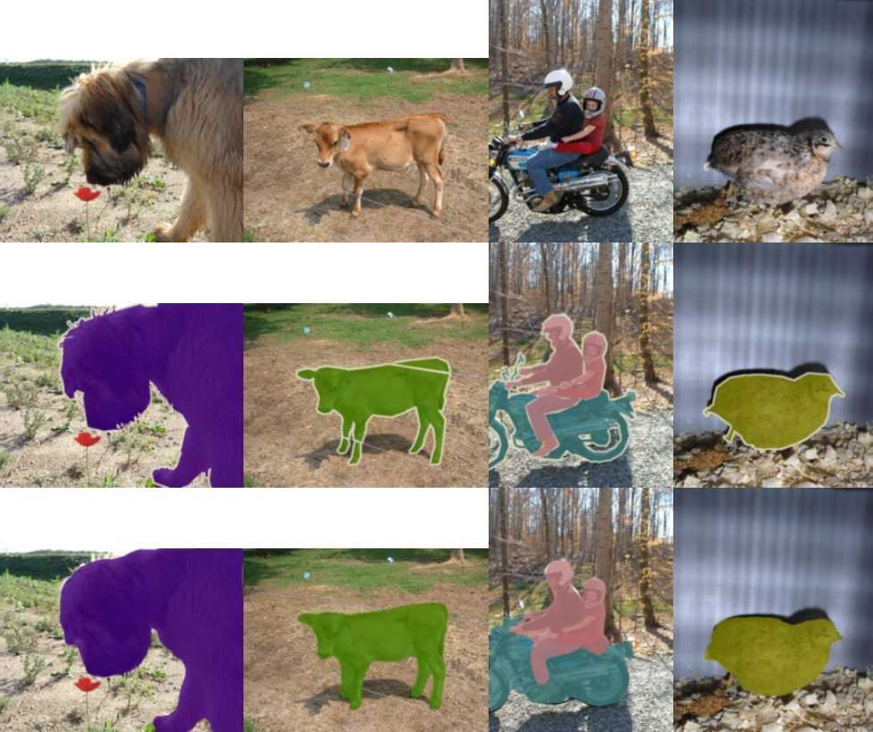
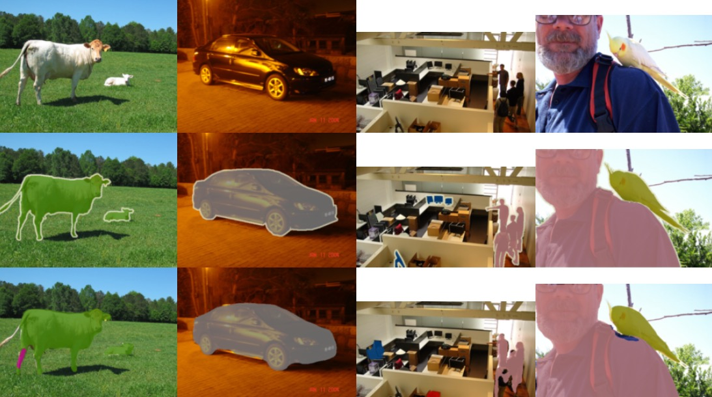
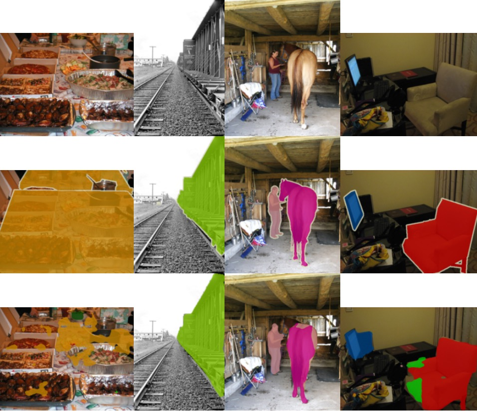

# voc_encoder_decoder_with_atrous_separable_convolutions

This repository contains a Tensorflow 2.3 implementation of [Encoder-Decoder with Atrous Separable Convolution for Semantic Image Segmentation][encoder_decoder_paper] algorithm.
Code for training and evaluating algorithm on VOC2012 segmentation competition is also provided.

[encoder_decoder_paper]: https://arxiv.org/abs/1802.02611

### Implementation details

This implementation has a few minor differences from original paper:
- Resnet-50 pretrained on ImageNet is used for base network - original paper replaces Resnet-50 with an alternative implementation based on separable convolutions. Since no weights, nor easily accessible implementations, are provided for that model, we use Resnet-50 instead.
- less convolutional filters are used throughout the model, especially in atrous spatial pyramid pooling module - this is only to keep GPU memory and computational time reasonable given hardware available to us.
- training schema - original paper first trains on VOC2012 + Hariharan datasets, then performs fine-tuning on VOC2012 dataset only, because Hariharan samples have worse quality segmentations for difficult categories, e.g. bicycles. We instead upsample number of difficult categories samples from both VOC2012 and Hariharan datasets, and don't perform fine tuning on VOC2012 dataset only. While schema from the paper is likely to give better results, we chose to go with a simpler implementation instead.

### Results

We present three sets of images to show some of the best results, average results and failure cases.
For each collage top row shows input images, middle row shows ground truth segmentations, and bottom row shows our predictions.

#### Good results

#### Average results

#### Failures

Mean intersection over union of the best trained model for the validation dataset was **0.7408**, with performance on each category provided in table below.

Category | Intersection over union
--- | ---
aeroplane | 0.8641
background | 0.9621
bicycle | 0.4112
bird | 0.8431
boat | 0.6836
bottle | 0.7946
bus | 0.9014
car | 0.8560
cat | 0.9028
chair | 0.4297
cow | 0.7950
diningtable | 0.4203
dog | 0.7963
horse | 0.7890
motorbike | 0.8111
person | 0.8484
pottedplant | 0.6055
sheep | 0.8004
sofa | 0.5065
train | 0.7990
tvmonitor | 0.7370

### How to run

A docker container is provided to run the project, along with a few helper host-side invoke tasks to start and manage the environment.
Almost every task accepts `--config-path` argument, a path to configuration file that defines paths to data, batch size to use, etc.
You can refer to `config.yaml` for a sample configuration file.

Host-side invoke tasks are:
- `docker.build_app_container` - builds main container inside which train, analysis, and visualization tasks can be run
- `docker.compose-up` - this is a thin wrapper around docker-compose task that starts `nginx` container for serving data visualizations, and `mlflow` container for storing and serving training and evaluation metrics.
- `docker.run` - runs app container. This is kept separate from `docker.compose-up` task, because at the time of this writing `docker-compose` can't start a container with access to GPU, while `docker` can.

Inside the container, the most important `invoke` tasks are:
- `ml.train` - trains model
- `analysis.analyze-model` - computes mean intersection over union of ground truth segmentations and model predictions
- `visualize.visualize-predictions` - visualizes model predictions

### How to extend

To use this project with a different dataset than VOC2012:
- implement a new data loader class - look at e.g. `net.data.CombinedPASCALDatasetsLoader` for a sample implementation
- write configuration file that specifies data paths and other configuration details - refer to `config.yaml` for an example
